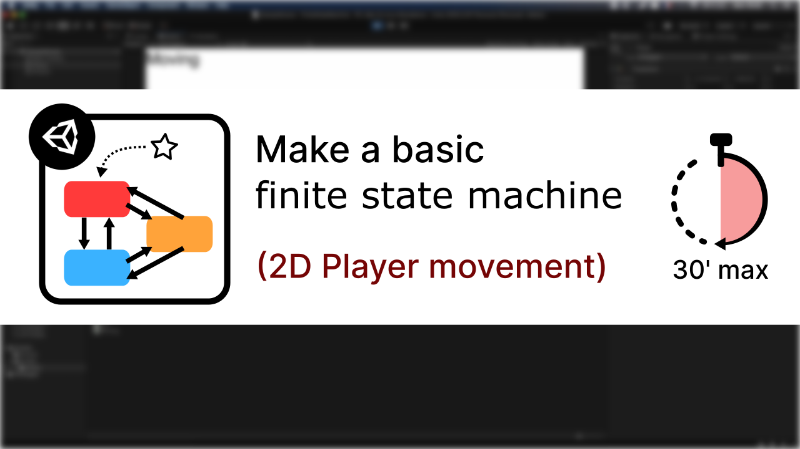

# [Unity/C#] Finite State Machines

**Mina Pêcheux - July 2021**

What are FSMs, aka Finite State Machines? How can we use one to implement basic physics-based 2D player movement? Let's discover more in these 2 video/text tutorials:

- "How to make a basic finite state machine in less than 30 minutes" (read it [on Medium](https://medium.com/c-sharp-progarmming/make-a-basic-fsm-in-unity-c-f7d9db965134) or watch it [on Youtube](https://www.youtube.com/watch?v=-VkezxxjsSE))
- "How to make a hierarchical finite state machine in less than 30 minutes" (read it [on Medium](https://medium.com/geekculture/make-a-hierarchical-fsm-in-unity-c-6809d49f8955) or watch it [on Youtube](https://www.youtube.com/watch?v=OtUKsjPWzO8))

In these tutorials, I'm discussing how we can model entity behaviour via state machines, what are the benefits and the
costs of implementing one and how hierarchical state machines can help you share logic without repeating code. The series
uses 2D physics-based player movement (with rigidbodies) as a direct application example.

This Github repo contains the code that is written throughout those tutorials:

- the parent virtual classes that define state machines and their inherent states
- the actual instantiable classes derived from those for our specific 2D-movement state machine

